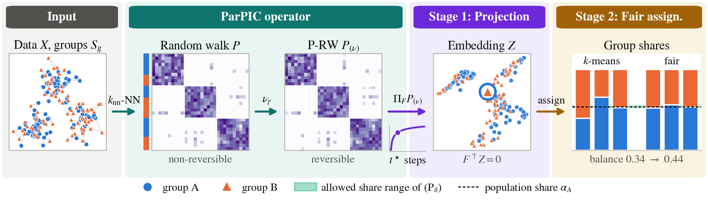
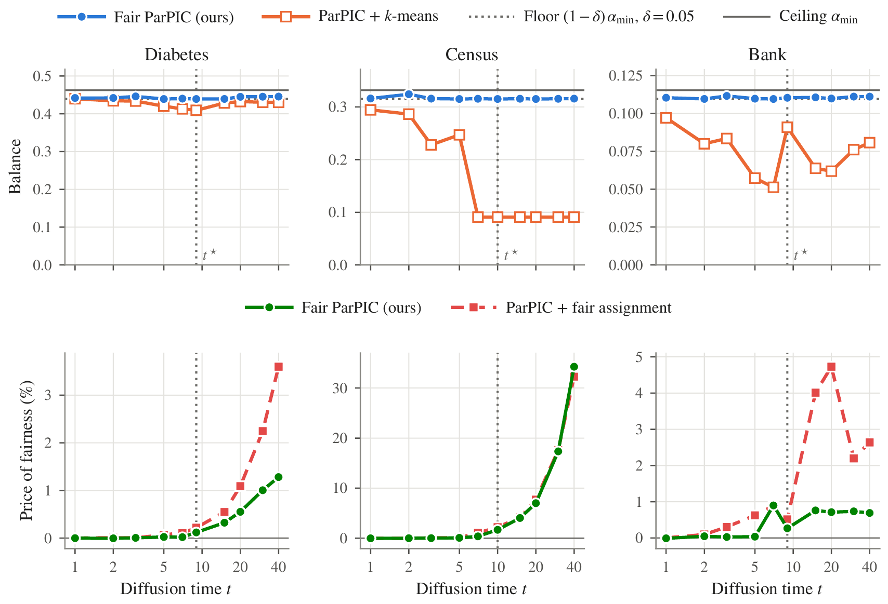
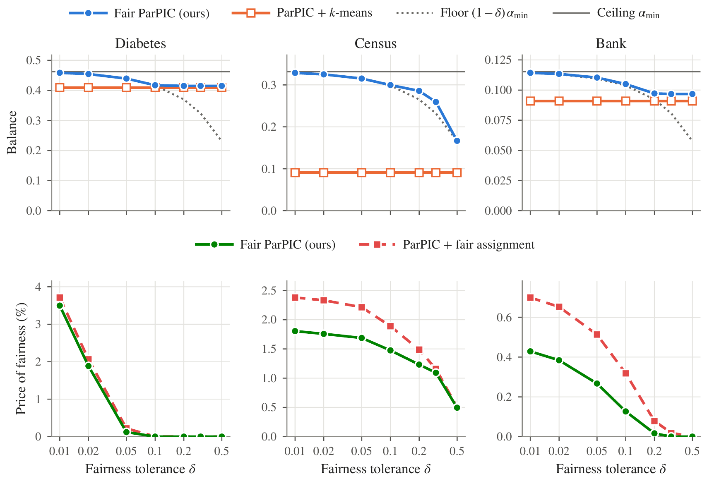
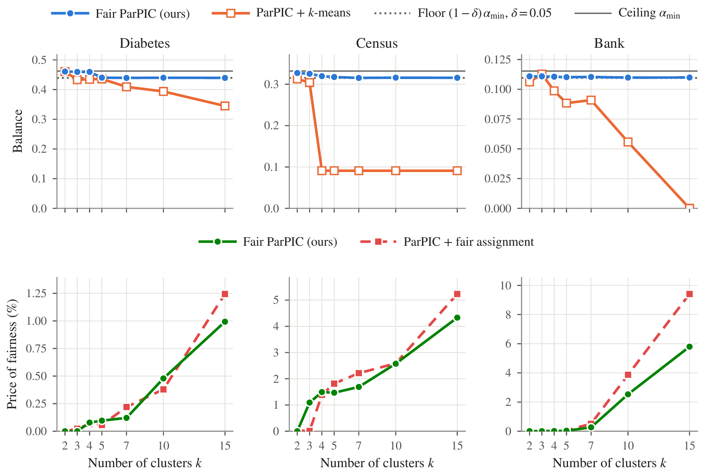
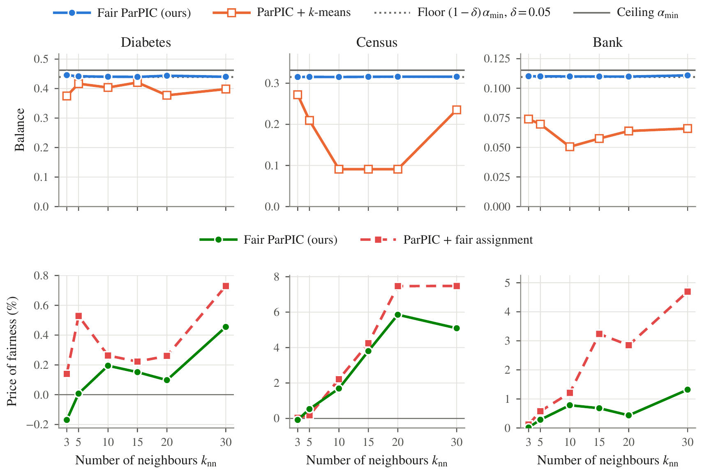
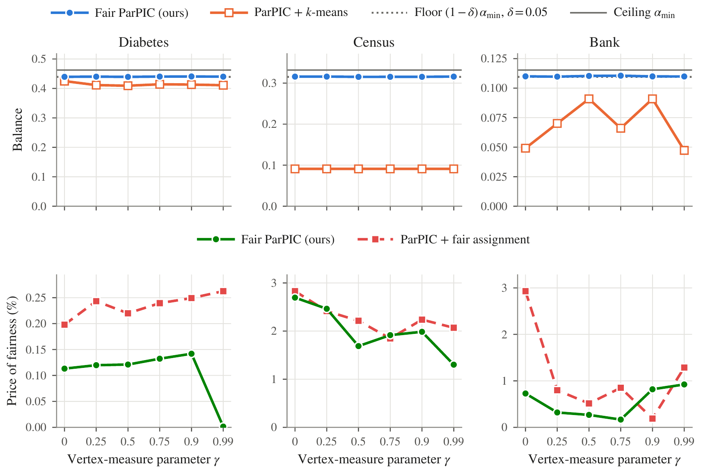
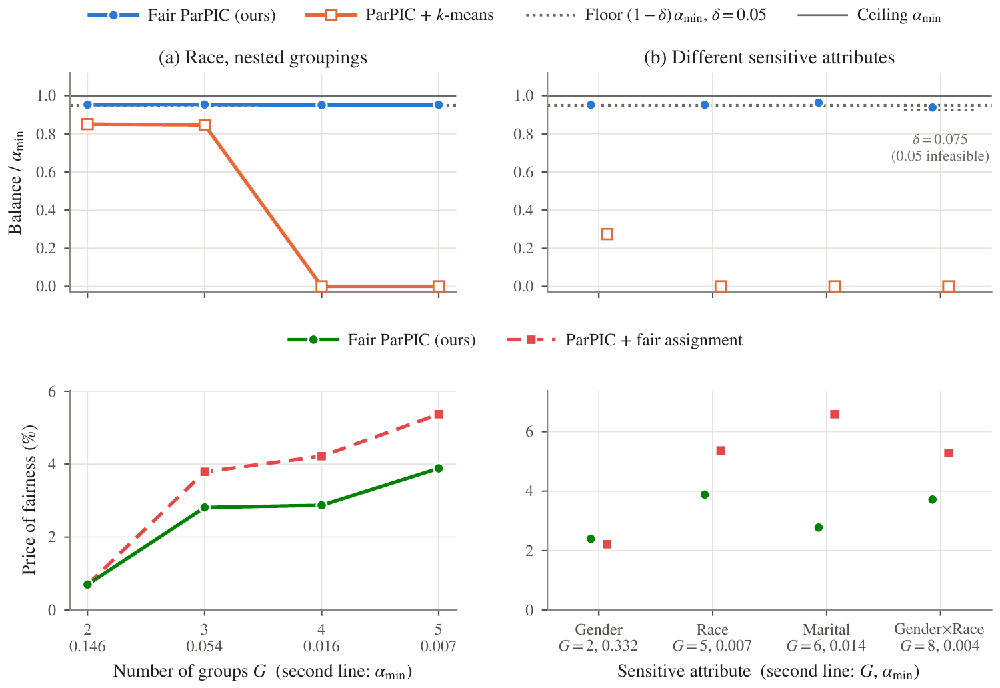

# Fair Parametrized Power-Iteration Clustering (Fair ParPIC)

This repository contains the official Python implementation of **Fair ParPIC: Fair Parametrized Power-Iteration Clustering on Directed Graphs**.

Fair ParPIC is a two-stage fair clustering method for **directed graphs** with provable guarantees. It builds on Parametrized Power-Iteration Clustering (ParPIC), which clusters a digraph by power iteration of a reversible random walk parametrized by a vertex measure, without symmetrizing the graph and without any eigendecomposition. Fair ParPIC makes this pipeline fair with respect to a sensitive attribute (gender, marital status, race, ...) and **certifies** the balance of every cluster it returns.

## 📖 Table of Contents
* [Overview](#-overview)
* [Key Contributions](#-key-contributions)
* [Repository Structure](#-repository-structure)
* [Installation](#️-installation)
* [Usage](#-usage)
* [Experimental Results](#-experimental-results)
* [Sensitivity Analysis](#-sensitivity-analysis)

## Overview

Unconstrained clustering has no incentive to avoid clusters composed almost entirely of one group whenever group membership is correlated with the similarity structure. Fair spectral methods address this on **undirected** graphs, but many similarity graphs are naturally **directed** (in a $k_{\mathrm{nn}}$-NN graph, "$j$ is among $i$'s nearest neighbors" is not symmetric; citations and hyperlinks are directed by nature).

Fair ParPIC works as follows:

1. Build the directed $k_{\mathrm{nn}}$-NN digraph (or take a given digraph $W$) and its natural random walk $P = D_{\mathrm{out}}^{-1}W$.

2. Turn it into ParPIC's reversible **P-RW operator** $P_{(\nu)} = (D_\nu + D_\xi)^{-1}(D_\nu P + P^\top D_\nu)$, with the degree-based vertex measure $\nu_\gamma$ and $\xi = P^\top\nu$. It is reversible with respect to $\pi = \pi_{(\nu)} = (\nu+\xi)/\mathbf{1}^\top(\nu+\xi)$, i.e. self-adjoint in the inner product $\langle u, v\rangle_\pi = u^\top D_\pi v$.

3. Select the diffusion time $t^\star$ at the knee of the estimated row-entropy curve $\widehat H(t)$ of $P_{(\nu)}^t$.

4. **Stage 1 — Fair projection.** Run the power iteration and project every step onto $\mathcal{N}_F = \mathrm{null}(F^\top)$, where $F$ is the centered group-indicator matrix $F(i,g) = \mathbb{1}\{i \in S_g\} - \alpha_g$. The projection is orthogonal in $\langle\cdot,\cdot\rangle_\pi$, the inner product of the diffusion geometry:

$$ Z^{(\tau)} = \Pi_\pi\, P_{(\nu)}\, Z^{(\tau-1)}, \qquad \Pi_\pi = I_n - D_\pi^{-1}F\big(F^\top D_\pi^{-1}F\big)^{-1}F^\top, \qquad \tau = 1,\dots,t^\star .$$

   This enforces $F^\top Z = 0$ exactly at every iterate, i.e., **centroid parity**: all groups have the same mean in the embedding.

5. **Stage 2 — Fair assignment.** Centroid parity does *not* imply balanced clusters (fairness can be lost in the final $k$-means step), so $k$-means is replaced by an alternating fair assignment that, for fixed centers $\mu_c$, solves

$$ (\mathrm{P}_\delta):\ \min_{x \in \{0,1\}^{n\times k}} J(x,\mu) = \sum_{i,c} x_{ic}\|z_i-\mu_c\|^2 \ \ \text{s.t.}\ \ \sum_c x_{ic}=1,\ \ (1-\delta)\alpha_g \le r_g(C_c) \le \min\Big(1, \frac{\alpha_g}{1-\delta}\Big),\ \ |C_c|\ge 1,$$

   where $r_g(C_c) = |C_c\cap S_g|/|C_c|$ is the share of group $g$ in cluster $c$, with a scalable LP → count-rounding → transportation solver that satisfies the share bounds **exactly** and reports a certified optimality gap.

**The Fair ParPIC pipeline:**
Below is the full pipeline on a small synthetic example ($n = 180$, $k = 3$, $G = 2$, $\delta = 0.05$): the projection makes the group centroids coincide, $k$-means on the projected embedding still yields group shares outside the allowed range, and the fair assignment brings every cluster into it.

> 

## Key Contributions

* **Fairness inside an eigendecomposition-free iteration:** the $\pi$-orthogonal projection is applied at every power-iteration step and the iterates satisfy $F^\top Z = 0$ to machine precision (Proposition 1). They form a power iteration of $T_\pi = \Pi_\pi P_{(\nu)}|_{\mathcal{N}_F}$, a self-adjoint compression of $P_{(\nu)}$ whose spectrum interlaces that of $P_{(\nu)}$ (Theorem 1), so the diffusion geometry is preserved and ParPIC's diffusion time can be reused (Theorem 2).

* **The discretization gap:** we prove that centroid parity of the embedding does not transfer to the $k$-means labels; the same gap affects fair spectral methods such as FairSC and FairDen.

* **Certified fair labels:** every feasible assignment satisfies $(1-\delta)\alpha_{\min} \le \mathrm{balance} \le \alpha_{\min}$ (Theorem 3); we also prove feasibility conditions, minimal intervention (the assignment departs from $k$-means only where a share bound would be violated), and monotone convergence of the alternation.

* **Fairness made cheaper:** the projection lowers the *price of fairness* (relative increase in within-cluster sum of squares) of the exact assignment, e.g. from 2.1% to 0.8% on Bank Marketing.

## Repository Structure

The codebase is organized as follows:

```text
├── LICENSE
├── README.md
├── requirements.txt
├── main_pipeline.py          # Real-data experiment (Tables 2 and 3 of the paper)
├── experiment_synthetic.py   # Synthetic directed networks (Appendix E.2, Table S2)
├── run_all.sh                # Runs the full experimental pipeline
├── experiments/              # Appendix experiments (self-contained scripts, see experiments/README.md)
│   ├── experiment_scale.py           # Stage 1 on the full datasets (Table S1)
│   ├── experiment_spectrum.py        # Theorems 1-2 on the full spectra (Table S3)
│   ├── experiment_diffusion_time.py  # Behavior across diffusion times (Fig. S1)
│   ├── experiment_delta.py           # Fairness tolerance delta (Fig. S2)
│   ├── experiment_k_knn.py           # Number of clusters k and neighbors k_nn (Figs. S3, S4)
│   ├── experiment_gamma.py           # Vertex-measure parameter gamma (Fig. S5)
│   └── experiment_groups.py          # Number of protected groups (Fig. S6, Table S4)
├── src/
│   ├── fair_parpic.py        # FairParPIC estimator; ParPIC / FP-ParPIC embeddings
│   ├── parpic.py             # k_nn-NN digraph, P-RW operator and pi_(nu), entropy-based diffusion time
│   ├── fairness.py           # Group-indicator matrix F, pi-orthogonal projector Pi_pi, balance objective
│   ├── fair_assignment.py    # Fair assignment (P_delta): decomposition & MILP solvers, fair k-means
│   ├── model_selection.py    # Elbow selection of k_nn and k
│   ├── metrics.py            # Price of fairness, silhouette, substantive clusters
│   └── data.py               # Loading / cleaning of Diabetes, UCI Census and Bank Marketing
├── notebooks/
│   └── fair_parpic.ipynb     # Original development notebook (earlier version with the Euclidean
│                             #   projector; superseded by src/, kept for reference)
├── data/
│   └── README.md             # Where to download the three datasets
└── assets/
    ├── figures/              # The paper's figures (vector PDF)
    └── images/               # PNG renderings used in this README
```

## Installation

To run the pipeline, ensure you have Python ≥ 3.9 installed along with the required dependencies. We recommend setting up a virtual environment.

```bash
git clone https://github.com/<your-username>/FairParPIC.git
cd FairParPIC
pip install -r requirements.txt
```

The dependencies are NumPy, SciPy (≥ 1.9, whose `milp` wraps the HiGHS solver), scikit-learn and pandas, plus Matplotlib for the figures of the appendix experiments. Download the three real datasets into `data/` as described in [`data/README.md`](data/README.md).

## Usage

**Run the full experimental pipeline:**

```bash
bash run_all.sh
```

**Run the real-data experiment on one dataset:**

```bash
python main_pipeline.py --dataset census --k 7 --n-neighbors 10
python main_pipeline.py --dataset bank --delta 0.1 --solver milp     # other tolerance / exact MILP
```

**Run the synthetic directed-network experiment** (a subset via environment variables):

```bash
python experiment_synthetic.py
TYPES=A LEVELS=none,strong python experiment_synthetic.py
```

**Reproduce the appendix experiments** (Tables S1 and S3, Figs. S1–S6; see [`experiments/README.md`](experiments/README.md)):

```bash
python experiments/experiment_delta.py                    # Fig. S2 -> results/, figures/
DATASET=Diabetes python experiments/experiment_gamma.py   # one dataset only
python experiments/experiment_scale.py Census             # Table S1, one dataset
```

**Use Fair ParPIC on your own data:**

```python
from src import FairParPIC

# X: (n, p) feature matrix, s: (n,) sensitive attribute (any labels)
model = FairParPIC(n_clusters=7, n_neighbors=10, delta=0.05)
labels = model.fit_predict(X, s)
print(model.balance_, model.floor_, model.alpha_min_)   # floor <= balance <= alpha_min

# Directed graph given directly (citation, hyperlink, social networks, ...)
labels = FairParPIC(n_clusters=5).fit_predict(adjacency=W, sensitive=s)
```

The vertex-measure parameter must satisfy $0 \le \gamma < 1$: at $\gamma = 1$ the vertex measure vanishes on some vertices and the projection degenerates, so `FairParPIC` rejects it. If no clustering can satisfy the share bounds, `InfeasibleFairnessError` is raised instead of silently returning an unfair clustering. Feasibility requires every group to have at least $k$ members (Proposition 2), but this is not sufficient for very small intersectional groups (Remark S2); use a larger $\delta$ or a smaller $k$ in that case.

## Experimental Results

Fair ParPIC was compared with PIC, AdaPIC, the Fair p-Assignment of Bera et al., FairSC, FairDen, unconstrained ParPIC and its Stage 1 alone (FP-ParPIC, i.e. Stage 1 followed by $k$-means) on three real datasets ($n = 3{,}000$ stratified subsamples, $k = 7$, $\delta = 0.05$, mean ± standard deviation over five seeds).

### Real-World Datasets

| Method | Diabetes (gender, $G=2$) | Cl. | Census (gender, $G=2$) | Cl. | Bank (marital, $G=3$) | Cl. |
|---|:---:|:---:|:---:|:---:|:---:|:---:|
| PIC | 0.085 ± 0.169 | 3.2 | 0.000 ± 0.000 | 1.0 | 0.000 ± 0.000 | 1.2 |
| AdaPIC | 0.080 ± 0.160 | 3.8 | 0.013 ± 0.025 | 3.4 | 0.000 ± 0.000 | 2.4 |
| Fair p-Assignment | 0.323 ± 0.164 | 6.8 | 0.248 ± 0.017 | 6.0 | 0.088 ± 0.008 | 6.6 |
| FairSC | 0.427 ± 0.013 | 6.8 | 0.130 ± 0.065 | 6.0 | 0.069 ± 0.024 | 7.0 |
| FairDen | 0.420 ± 0.018 | 7.0 | 0.087 ± 0.107 | 6.2 | 0.094 ± 0.010 | 6.6 |
| ParPIC | 0.396 ± 0.052 | 6.6 | 0.130 ± 0.065 | 6.0 | 0.074 ± 0.011 | 6.8 |
| FP-ParPIC (Stage 1) | 0.398 ± 0.053 | 6.6 | 0.130 ± 0.065 | 6.2 | 0.077 ± 0.023 | 7.0 |
| **Fair ParPIC** | **0.445 ± 0.007** | 6.6 | **0.315 ± 0.001** | 6.4 | **0.110 ± 0.000** | 7.0 |
| *Guaranteed floor $(1-\delta)\alpha_{\min}$* | *0.439* | | *0.315* | | *0.109* | |
| *Ceiling $\alpha_{\min}$* | *0.462* | | *0.332* | | *0.115* | |

*Balance (higher is better); Cl. is the mean number of the $k = 7$ clusters holding at least 1% of the vertices.* Fair ParPIC attains balance within 5% of the best achievable value on every dataset and seed, with at least as many substantive clusters as ParPIC. FP-ParPIC is as unbalanced as ParPIC: the discretization gap, not the embedding, limits the balance.

**Price of fairness and cluster quality.** The projection makes the exact fair assignment cheaper (13 of the 15 runs), and the fair assignment barely changes the silhouette score:

| | Diabetes | Census | Bank |
|---|:---:|:---:|:---:|
| PoF — ParPIC + FA | 0.8% ± 1.0% | 2.2% ± 0.8% | 2.1% ± 1.1% |
| PoF — **Fair ParPIC** | **0.8% ± 1.0%** | **1.9% ± 0.5%** | **0.8% ± 0.3%** |
| Silhouette — ParPIC | 0.220 ± 0.018 | 0.110 ± 0.011 | 0.165 ± 0.013 |
| Silhouette — ParPIC + FA | 0.218 ± 0.018 | 0.104 ± 0.009 | 0.151 ± 0.013 |
| Silhouette — FP-ParPIC (Stage 1) | 0.220 ± 0.019 | 0.117 ± 0.007 | 0.158 ± 0.010 |
| Silhouette — **Fair ParPIC** | 0.218 ± 0.019 | 0.113 ± 0.007 | 0.156 ± 0.009 |

*ParPIC + FA is the ablation that runs the same fair assignment on the unprojected embedding; PoF is measured against $k$-means on the same embedding.*

### Stage 1 at a Larger Scale

Stage 1 uses only sparse products and a rank-$(G-1)$ correction, so it runs on the full datasets (Appendix E.1, `experiments/experiment_scale.py`: $k_{\mathrm{nn}} = 10$, $k = 10$, $k$-means discretization, seed 42, $t^\star = 10$ on all three):

| Dataset | $n$ | ParPIC balance | FP-ParPIC balance | $\max_{i,j}\lvert(F^\top Z)_{ij}\rvert$: ParPIC → FP-ParPIC | Time (s): ParPIC → FP-ParPIC |
|---|:---:|:---:|:---:|:---:|:---:|
| Diabetes | 70,000 | 0.417 | 0.439 | 3.5 × 10¹ → 2.0 × 10⁻¹² | 3.3 → 4.5 |
| Census | 48,842 | 0.190 | 0.185 | 7.8 × 10¹ → 1.9 × 10⁻¹³ | 1.4 → 1.7 |
| Bank | 45,211 | 0.068 | 0.089 | 9.1 × 10¹ → 2.2 × 10⁻¹³ | 1.0 → 1.3 |

The invariant $F^\top Z = 0$ holds to machine precision on graphs with up to 70,000 vertices, and the projection adds at most about a second. Stage 1 alone does not guarantee balance (it even decreases slightly on Census): the guarantee requires Stage 2.

### Synthetic Directed Networks

`experiment_synthetic.py` generates directed stochastic block models (no features, no $k_{\mathrm{nn}}$-NN graph) in which a fraction $p_{\mathrm{b}}$ of the edge mass points from later to earlier vertices, and a **group signal** $\eta \in [0, 1)$ controls how strongly the protected groups shape the links (Appendix E.2, Eq. S23). Balance (guaranteed floor $(1-\delta)\alpha_{\min}$ in brackets) and ARI to the planted clusters (Table S2):

| Network (floor) | $\eta$ | Balance: ParPIC | FP-ParPIC | **Fair ParPIC** | ARI: ParPIC | FP-ParPIC | **Fair ParPIC** |
|---|:---:|:---:|:---:|:---:|:---:|:---:|:---:|
| Citation, $n$ = 10,000 (0.2850) | 0 | 0.2945 | 0.2947 | **0.2947** | 0.895 | 0.895 | 0.895 |
| | 0.3 | 0.2957 | 0.2977 | **0.2977** | 0.916 | 0.918 | 0.918 |
| | 0.6 | 0.0012 | 0.2935 | **0.2935** | 0.396 | 0.912 | 0.912 |
| | 0.9 | 0.0000 | 0.0040 | **0.2862** | 0.280 | 0.603 | 0.801 |
| Popularity, $n$ = 8,000 (0.1425) | 0 | 0.0000 | 0.0000 | **0.1429** | 0.491 | 0.494 | 0.498 |
| | 0.3 | 0.0000 | 0.0000 | **0.1427** | 0.453 | 0.514 | 0.514 |
| | 0.6 | 0.0010 | 0.0000 | **0.1426** | 0.270 | 0.533 | 0.540 |
| | 0.9 | 0.0000 | 0.0094 | **0.1427** | 0.137 | 0.240 | 0.313 |
| Hyperlink, $n$ = 6,000 (0.2850) | 0 | 0.1500 | 0.1518 | **0.2854** | 1.000 | 0.998 | 0.846 |
| | 0.3 | 0.1494 | 0.1511 | **0.2852** | 1.000 | 0.999 | 0.848 |
| | 0.6 | 0.0000 | 0.1517 | **0.2853** | 0.546 | 0.999 | 0.848 |
| | 0.9 | 0.0000 | 0.1237 | **0.2853** | 0.330 | 0.967 | 0.833 |

Fair ParPIC meets its guarantee on all twelve networks; ParPIC reaches the floor on only two. A moderate group signal is removed by the projection alone (citation, $\eta = 0.6$: ARI 0.396 → 0.912). On the hyperlink networks, the planted clustering is itself unfair (balance 0.150), so reaching the floor necessarily moves vertices away from it. The price of fairness of Stage 2 is at most 3.7% over the twelve networks.

### Diffusion Time

The diffusion time $t^\star$ is selected by ParPIC's entropy criterion on the unprojected operator $P_{(\nu)}$, so it does not depend on the sensitive attribute; by Theorem 2 the projected diffusion loses modes on the same time scale. Across diffusion times (Appendix E.3, `experiments/experiment_diffusion_time.py`; $k = 7$, $\delta = 0.05$), Fair ParPIC stays between floor and ceiling at every $t$, and the price of fairness is small up to $t^\star$ (dotted line) and grows only with over-diffusion; the projection lowers it in 24 of the 30 settings.

> 

## Sensitivity Analysis

Each hyperparameter is varied one at a time ($n = 3{,}000$, seed 42; Appendix E.4; scripts in [`experiments/`](experiments/)). In every figure, the **top row** shows the balance of Fair ParPIC (blue) and unconstrained ParPIC with $k$-means (orange) against the floor (dotted) and ceiling (solid), and the **bottom row** shows the price of fairness with (green) and without (red) the projection. All 176 fair-assignment runs met the floor, and for $\gamma < 1$ the projection lowered the price of fairness in 69 of the 78 settings where the two prices differ.

### 1. Fairness tolerance $\delta$

$\delta$ is the only hyperparameter that enters the guarantee. Fair ParPIC follows the floor $(1-\delta)\alpha_{\min}$ while the constraint is active, and returns its $k$-means clustering at zero price as soon as that clustering satisfies the share bounds (minimal intervention). The projection never raises the price of fairness in this study.

> 

### 2. Number of clusters $k$

The balance of unconstrained ParPIC degrades as $k$ grows (reaching 0 on Bank at $k = 15$), whereas Fair ParPIC stays between floor and ceiling for every $k$; the projection slows the growth of the price of fairness at large $k$ (on Bank, 9.41% → 5.80% at $k = 15$).

> 

### 3. Number of neighbors $k_{\mathrm{nn}}$

The balance of ParPIC changes erratically with the graph, so tuning the graph is not a reliable route to fairness; the balance of Fair ParPIC varies by at most 0.006, and the projection lowers the price of fairness in 17 of 18 settings.

> 

### 4. Vertex-measure parameter $\gamma$

Fair ParPIC lies between floor and ceiling for every $\gamma < 1$, and its balance varies by at most 0.002; on Bank the projection keeps the price of fairness below 0.93% against up to 2.93% without it. The boundary $\gamma = 1$ violates the positivity of the vertex measure and must not be used with the projection.

> 

### 5. Number of protected groups $G$ (Census)

With small groups ($G \ge 4$), unconstrained clustering leaves at least one cluster without any member of the smallest group (balance 0), while Fair ParPIC holds its guarantee for every grouping, from $G = 2$ to gender × race ($G = 8$, which needs $\delta = 0.075$ because no fair 7-clustering exists at $\delta = 0.05$). More groups raise the price of fairness; the saving from the projection tends to grow with how far the groups are displaced in the unprojected embedding (largest on marital status, 6.59% → 5.09%).

> 

